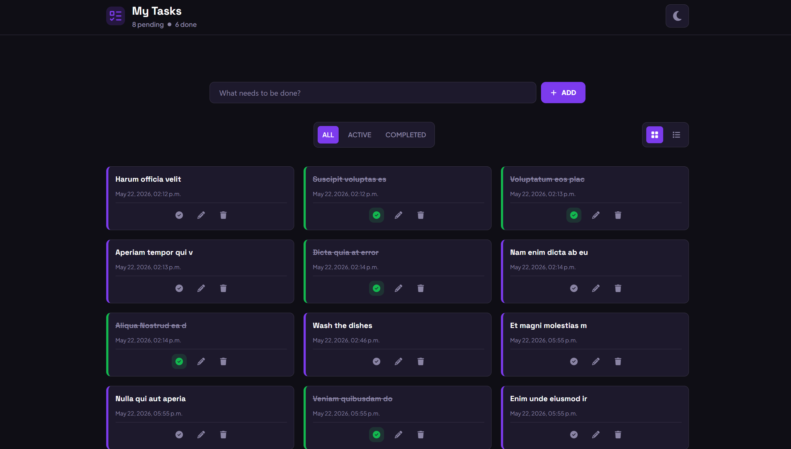

# My Tasks



## Description

**My Tasks** is a responsive task management application built with React. The application allows users to create, edit, complete, delete, and filter tasks through a clean and modern user interface.

The project was developed as part of a React front-end assignment and focuses on state management using the `useReducer` and `useState` hooks, side effects using `useEffect`, DOM manipulation using `useRef`, reusable component architecture, local storage persistence, and interactive user experiences.

## Features

- Create, edit, complete, and delete tasks
- Task filtering system (All, Active, Completed)
- Most recent tasks displayed at the top
- Persistent task, theme storage using `localStorage`
- Persistent delete confirmation using `sessionStorage`
- Dynamic task statistics (pending and completed tasks)
- Inline task editing functionality
- Responsive grid and list layouts
- Theme toggle (light/dark mode)
- Reusable React components
- State management using `useReducer`
- Immutable state updates using `.map()` and `.filter()`
- Dynamic task rendering
- Visual indicators for completed tasks
- Clean and responsive UI design
- Semantic and accessible JSX structure
- Interactive icons and hover effects

## Technologies Used

### Front-End

- React
- JavaScript
- CSS
- React Icons

### React Hooks

- `useReducer`
- `useState`
- `useEffect`
- `useRef`

### Tools Used

- VS Code
- Git
- GitHub
- NPM

## Key Implementation Details

### State Management with `useReducer`

The application uses the `useReducer` hook to manage task-related actions such as creating, editing, completing, and deleting tasks.

```jsx
export const tasksReducer = (tasks, action) => {
  switch (action.type) {
    case "CREATE":
      return [...tasks, action.payload];
    case "EDIT":
      return tasks.map((task) =>
        task.id === action.payload.id ? action.payload : task
      );
    case "COMPLETE":
      return tasks.map((task) =>
        task.id === action.payload.id ? action.payload : task
      );
    case "DELETE":
      return tasks.filter((task) => task.id !== action.payload.id);
    default:
      return tasks;
  }
};
```

### Task Filtering

Tasks are dynamically filtered based on the selected filter state without mutating the original tasks array.

```jsx
const displayedTasks =
  filter === "ACTIVE"
    ? pendingTasks
    : filter === "COMPLETED"
      ? completedTasks
      : tasks;
```

## Demo

Click [here](https://fejiro001.github.io/to-do/) to demo
